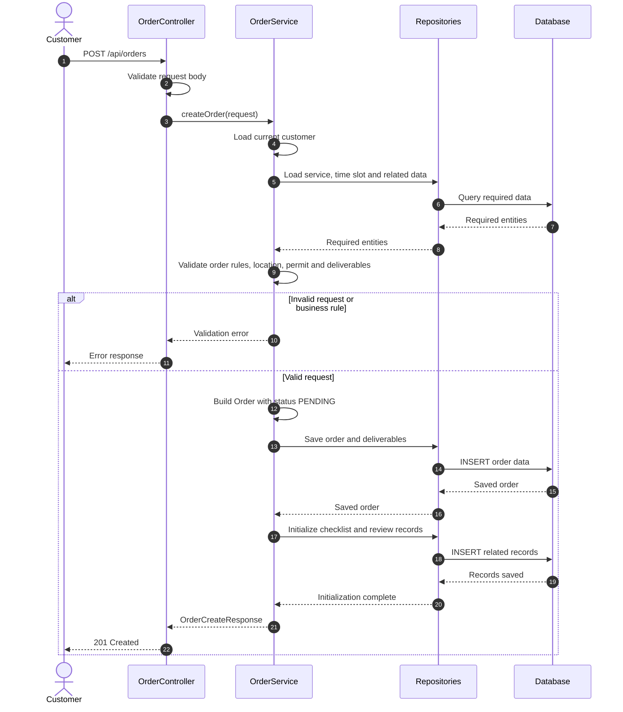

```mermaid
sequenceDiagram
    autonumber

    actor Customer
    participant Controller as OrderController
    participant Service as OrderService
    participant Repository as Repositories
    participant Database as Database

    Customer->>Controller: POST /api/orders
    Controller->>Controller: Validate request body
    Controller->>Service: createOrder(request)
    Service->>Service: Load current customer
    Service->>Repository: Load service, time slot and related data
    Repository->>Database: Query required data
    Database-->>Repository: Required entities
    Repository-->>Service: Required entities

    Service->>Service: Validate order rules, location, permit and deliverables

    alt Invalid request or business rule
        Service-->>Controller: Validation error
        Controller-->>Customer: Error response
    else Valid request
        Service->>Service: Build Order with status PENDING
        Service->>Repository: Save order and deliverables
        Repository->>Database: INSERT order data
        Database-->>Repository: Saved order
        Repository-->>Service: Saved order
        Service->>Repository: Initialize checklist and review records
        Repository->>Database: INSERT related records
        Database-->>Repository: Records saved
        Repository-->>Service: Initialization complete
        Service-->>Controller: OrderCreateResponse
        Controller-->>Customer: 201 Created
    end
```
