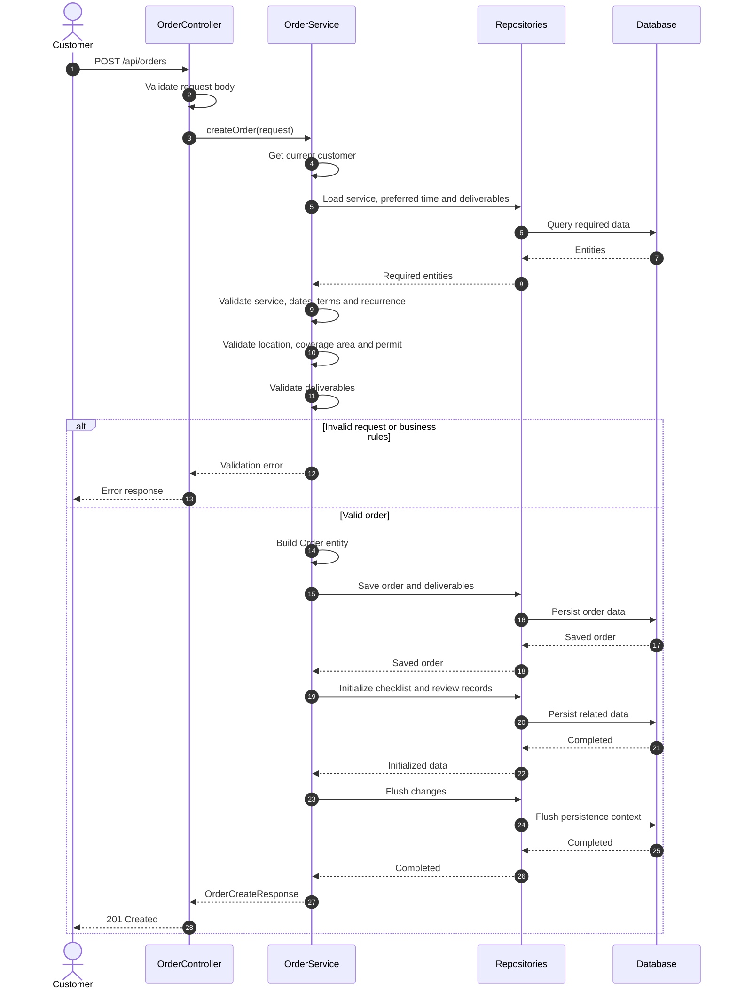

```mermaid
sequenceDiagram
    autonumber

    actor Customer
    participant Controller as OrderController
    participant Service as OrderService
    participant Repo as Repositories
    participant DB as Database

    Customer->>Controller: POST /api/orders
    Controller->>Controller: Validate request body
    Controller->>Service: createOrder(request)

    Service->>Service: Get current customer

    Service->>Repo: Load service, preferred time and deliverables
    Repo->>DB: Query required data
    DB-->>Repo: Entities
    Repo-->>Service: Required entities

    Service->>Service: Validate service, dates, terms and recurrence
    Service->>Service: Validate location, coverage area and permit
    Service->>Service: Validate deliverables

    alt Invalid request or business rules
        Service-->>Controller: Validation error
        Controller-->>Customer: Error response
    else Valid order
        Service->>Service: Build Order entity

        Service->>Repo: Save order and deliverables
        Repo->>DB: Persist order data
        DB-->>Repo: Saved order
        Repo-->>Service: Saved order

        Service->>Repo: Initialize checklist and review records
        Repo->>DB: Persist related data
        DB-->>Repo: Completed
        Repo-->>Service: Initialized data

        Service->>Repo: Flush changes
        Repo->>DB: Flush persistence context
        DB-->>Repo: Completed
        Repo-->>Service: Completed

        Service-->>Controller: OrderCreateResponse
        Controller-->>Customer: 201 Created
    end
```
