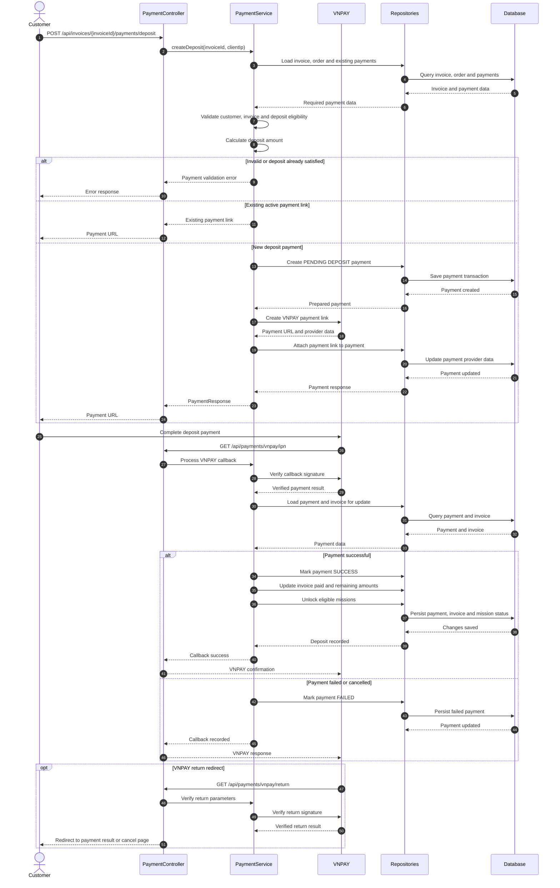

# Deposit Payment Sequence

```mermaid
sequenceDiagram
    autonumber

    actor Customer
    participant PaymentController
    participant PaymentService
    participant PaymentGateway as VNPAY
    participant Repo as Repositories
    participant DB as Database

    Customer->>PaymentController: POST /api/invoices/{invoiceId}/payments/deposit
    PaymentController->>PaymentService: createDeposit(invoiceId, clientIp)

    PaymentService->>Repo: Load invoice, order and existing payments
    Repo->>DB: Query invoice, order and payments
    DB-->>Repo: Invoice and payment data
    Repo-->>PaymentService: Required payment data

    PaymentService->>PaymentService: Validate customer, invoice and deposit eligibility
    PaymentService->>PaymentService: Calculate deposit amount

    alt Invalid or deposit already satisfied
        PaymentService-->>PaymentController: Payment validation error
        PaymentController-->>Customer: Error response
    else Existing active payment link
        PaymentService-->>PaymentController: Existing payment link
        PaymentController-->>Customer: Payment URL
    else New deposit payment
        PaymentService->>Repo: Create PENDING DEPOSIT payment
        Repo->>DB: Save payment transaction
        DB-->>Repo: Payment created
        Repo-->>PaymentService: Prepared payment

        PaymentService->>PaymentGateway: Create VNPAY payment link
        PaymentGateway-->>PaymentService: Payment URL and provider data

        PaymentService->>Repo: Attach payment link to payment
        Repo->>DB: Update payment provider data
        DB-->>Repo: Payment updated
        Repo-->>PaymentService: Payment response

        PaymentService-->>PaymentController: PaymentResponse
        PaymentController-->>Customer: Payment URL
    end

    Customer->>PaymentGateway: Complete deposit payment

    PaymentGateway->>PaymentController: GET /api/payments/vnpay/ipn
    PaymentController->>PaymentService: Process VNPAY callback
    PaymentService->>PaymentGateway: Verify callback signature
    PaymentGateway-->>PaymentService: Verified payment result

    PaymentService->>Repo: Load payment and invoice for update
    Repo->>DB: Query payment and invoice
    DB-->>Repo: Payment and invoice
    Repo-->>PaymentService: Payment data

    alt Payment successful
        PaymentService->>Repo: Mark payment SUCCESS
        PaymentService->>Repo: Update invoice paid and remaining amounts
        PaymentService->>Repo: Unlock eligible missions
        Repo->>DB: Persist payment, invoice and mission status
        DB-->>Repo: Changes saved
        Repo-->>PaymentService: Deposit recorded
        PaymentService-->>PaymentController: Callback success
        PaymentController-->>PaymentGateway: VNPAY confirmation
    else Payment failed or cancelled
        PaymentService->>Repo: Mark payment FAILED
        Repo->>DB: Persist failed payment
        DB-->>Repo: Payment updated
        PaymentService-->>PaymentController: Callback recorded
        PaymentController-->>PaymentGateway: VNPAY response
    end

    opt VNPAY return redirect
        PaymentGateway->>PaymentController: GET /api/payments/vnpay/return
        PaymentController->>PaymentService: Verify return parameters
        PaymentService->>PaymentGateway: Verify return signature
        PaymentGateway-->>PaymentService: Verified return result
        PaymentController-->>Customer: Redirect to payment result or cancel page
    end
```
