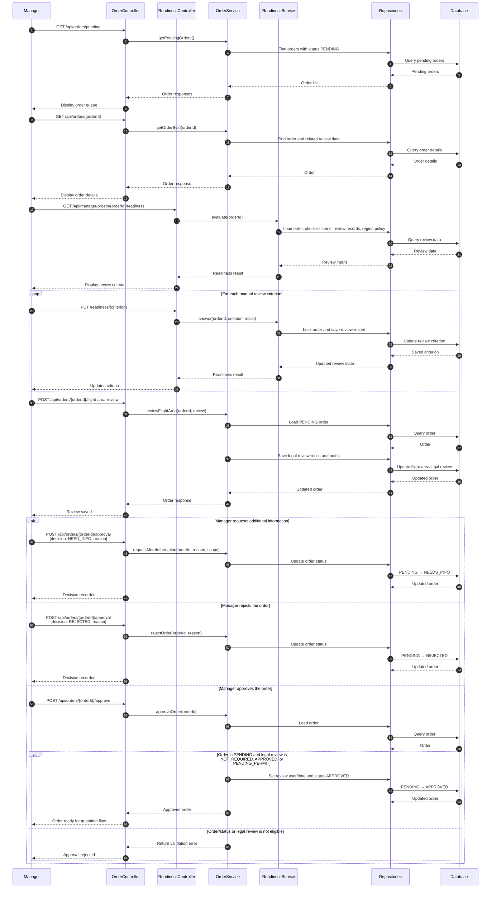

# Manager Review/Approval Order Flow

```mermaid
sequenceDiagram
    autonumber

    participant Manager
    participant OrderController
    participant ReadinessController
    participant OrderService
    participant ReadinessService
    participant Repositories
    participant Database

    Manager->>OrderController: GET /api/orders/pending
    OrderController->>OrderService: getPendingOrders()
    OrderService->>Repositories: Find orders with status PENDING
    Repositories->>Database: Query pending orders
    Database-->>Repositories: Pending orders
    Repositories-->>OrderService: Order list
    OrderService-->>OrderController: Order responses
    OrderController-->>Manager: Display order queue

    Manager->>OrderController: GET /api/orders/{orderId}
    OrderController->>OrderService: getOrderById(orderId)
    OrderService->>Repositories: Find order and related review data
    Repositories->>Database: Query order details
    Database-->>Repositories: Order details
    Repositories-->>OrderService: Order
    OrderService-->>OrderController: Order response
    OrderController-->>Manager: Display order details

    Manager->>ReadinessController: GET /api/manager/orders/{orderId}/readiness
    ReadinessController->>ReadinessService: evaluate(orderId)
    ReadinessService->>Repositories: Load order, checklist items, review records, region policy
    Repositories->>Database: Query review data
    Database-->>Repositories: Review data
    Repositories-->>ReadinessService: Review inputs
    ReadinessService-->>ReadinessController: Readiness result
    ReadinessController-->>Manager: Display review criteria

    loop For each manual review criterion
        Manager->>ReadinessController: PUT /readiness/{criterion}
        ReadinessController->>ReadinessService: answer(orderId, criterion, result)
        ReadinessService->>Repositories: Lock order and save review record
        Repositories->>Database: Update review criterion
        Database-->>Repositories: Saved criterion
        Repositories-->>ReadinessService: Updated review state
        ReadinessService-->>ReadinessController: Readiness result
        ReadinessController-->>Manager: Updated criteria
    end

    Manager->>OrderController: POST /api/orders/{orderId}/flight-area-review
    OrderController->>OrderService: reviewFlightArea(orderId, review)
    OrderService->>Repositories: Load PENDING order
    Repositories->>Database: Query order
    Database-->>Repositories: Order
    OrderService->>Repositories: Save legal review result and notes
    Repositories->>Database: Update flight-area/legal review
    Database-->>Repositories: Updated order
    Repositories-->>OrderService: Updated order
    OrderService-->>OrderController: Order response
    OrderController-->>Manager: Review saved

    alt Manager requests additional information
        Manager->>OrderController: POST /api/orders/{orderId}/approval<br/>{decision: NEED_INFO, reason}
        OrderController->>OrderService: requestMoreInformation(orderId, reason, scope)
        OrderService->>Repositories: Update order status
        Repositories->>Database: PENDING → NEEDS_INFO
        Database-->>Repositories: Updated order
        OrderController-->>Manager: Decision recorded
    else Manager rejects the order
        Manager->>OrderController: POST /api/orders/{orderId}/approval<br/>{decision: REJECTED, reason}
        OrderController->>OrderService: rejectOrder(orderId, reason)
        OrderService->>Repositories: Update order status
        Repositories->>Database: PENDING → REJECTED
        Database-->>Repositories: Updated order
        OrderController-->>Manager: Decision recorded
    else Manager approves the order
        Manager->>OrderController: POST /api/orders/{orderId}/approve
        OrderController->>OrderService: approveOrder(orderId)
        OrderService->>Repositories: Load order
        Repositories->>Database: Query order
        Database-->>Repositories: Order

        alt Order is PENDING and legal review is NOT_REQUIRED, APPROVED, or PENDING_PERMIT
            OrderService->>Repositories: Set review user/time and status APPROVED
            Repositories->>Database: PENDING → APPROVED
            Database-->>Repositories: Updated order
            OrderService-->>OrderController: Approved order
            OrderController-->>Manager: Order ready for quotation flow
        else Order/status or legal review is not eligible
            OrderService-->>OrderController: Return validation error
            OrderController-->>Manager: Approval rejected
        end
    end
```
